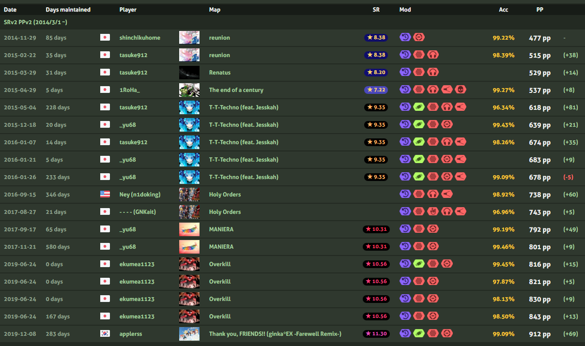

# osu!taiko PP Record History


This repository documents the historical progression of top osu!taiko performance point (PP) records.  
All records are manually collected from web archives, osu! comments, social media posts, and community contributions.

🌐 **Live Website:**  
https://calmeel.github.io/osu-taiko-pp-record-history/


## 📖 Purpose

The goal of this project is to preserve the historical context of osu!taiko PP achievements over time, including:

- Highest PP values
- Player information
- Map details (SR, BPM, mapper)
- Mods used
- Replay availability
- Dates and record eras
- Days maintained for each record

This information is not officially tracked anywhere and would otherwise be lost as older plays become buried.


## 🔄 Data Source & Maintenance

Records are manually collected through:

- osu! web archives
- replay uploads
- screenshots and video evidence
- community posts and comments
- historical leaderboard captures

Fields such as **Days maintained** are automatically updated daily via GitHub Actions.


## 📂 Repository Structure
```
osu-taiko-pp-record-history/
│
├─ index.html -> Generated public site
├─ style.css -> Styling
├─ build_html.py -> HTML generator
├─ data.xlsx -> Raw data source
│
├─ jackets/ -> Beatmap jacket art
├─ ref_icons/ -> External link icons
├─ icons_mod/ -> Mod icons
├─ icons_flag/ -> Country flags
└─ replays/ -> .osr replay files
```

Replay files are provided when available for verification and archival purposes.


## 🕒 Automation

A daily GitHub Actions workflow runs automatically to:

- regenerate `index.html`
- update day counters
- push changes if any

This ensures the site stays up-to-date without manual intervention.


## 🤝 Contributing

Community contributions are welcome—especially if you:

- know of records that are missing
- have replay files
- have date corrections
- found inaccurate or conflicting information

If you would like to contribute, you can open an issue or contact me directly.

## 📚 Archival Purpose

This project is intended as a **community-based archive** and as a form of **long-term digital preservation** for notable osu!taiko PP records.  
Many historical plays become difficult or impossible to reconstruct once forum posts, videos, comments, or leaderboard snapshots disappear over time.  
This archive aims to maintain accessible context such as:
- PP value
- player information
- map data
- replay availability
- era-specific scoring conditions
- links to primary sources (YouTube, X/Twitter, Reddit, osu!, etc.)

This project is **non-commercial** and maintained with no malicious intent.


## 🛡 Asset Ownership & Use Policy

Different assets within this repository have different ownership. The following clarifies usage and intent:

### **→ Beatmap Jacket Art**
Jacket images remain the property of their respective copyright holders.  
They are included solely for **identification, historical context, and archival purposes**.  
This project does not claim ownership or redistribution rights to these assets.

### **→ Replay Files (.osr)**
Replay files are included for **verification and archival purposes**.  
Players retain ownership of their own gameplay data.  
If you are the player and would prefer your replay not to be included, I will remove it immediately upon request.

### **→ Platform Logos (YouTube / X / Reddit / osu!)**
These logos are recognized trademarks of their respective owners.  
They are used exclusively to **indicate link destinations**, and **no affiliation or endorsement is implied**.

### **→ Mod Icons & Flag Icons**
Mod and flag icons originate from the open-source project `osu-web` (MIT licensed).  
Source: https://github.com/ppy/osu-web  
License: MIT  
These are used under the terms of that license with proper attribution.


## 📑 Legal & Trademark Notes

- **No ownership is transferred or implied**
- **No assets are monetized**
- **No endorsement is implied**
- **External assets remain under their original Terms of Service**
- **Content is shown only as necessary for documentation and verification**

This repository and its maintainer are not affiliated with osu!, ppy, or any platform referenced within this project.


## 🧾 Removal & Correction Requests

If you:
- are the rights holder of a linked video or media,
- are the creator of a beatmap jacket,
- are the player of a replay file,
- or are the copyright holder of any relevant asset,

and would prefer your content not to be included, please contact me and I will take immediate action without dispute.

For removal or correction requests, contact:

> Discord: `vanity8`


## 📘 Licensing

This repository contains multiple asset types with distinct ownership.  
To avoid accidental commercial re-use and to protect rights holders, this archive is distributed under:

> **CC BY-NC-SA 4.0 — Attribution, Non-Commercial, Share-Alike**

This license applies to:
- data formatting
- HTML/CSS/JS
- documentation
- research notes

Asset-specific exceptions:

| Asset Type | License / Ownership |
|---|---|
| Jacket art | Copyright holders (not redistributed for commercial use) |
| Replay files | Players (archival only) |
| Platform logos | Trademark owners |
| Mod/flag icons | MIT (from osu-web) |
| Other assets | © Their respective owners |

For full license details, see: LICENSE, NOTICE, and ATTRIBUTION.md

## 🎯 Intent Summary

This project exists to:
- preserve community history,
- maintain public access to otherwise ephemeral information,
- avoid data loss,
- assist verification and research,
- support the osu!taiko community long-term.

No part of this project is intended for commercial use, exploitation, defamation, or harm.


## 📬 Contact

Discord id: **vanity8**  
(If you have replays, missing plays, or corrections, please message me!)

## 📜 Disclaimer

This is an unofficial historical project not affiliated with osu! or ppy.  
All replays and assets belong to their respective owners and are preserved strictly for archival and documentation purposes.

## 🌟 Credits

- osu! — https://osu.ppy.sh/
- osu!taiko community for historical context and replay sharing
- Everyone who helped preserve old records before they disappeared
Replay files are provided when available for verification and archival purposes.
